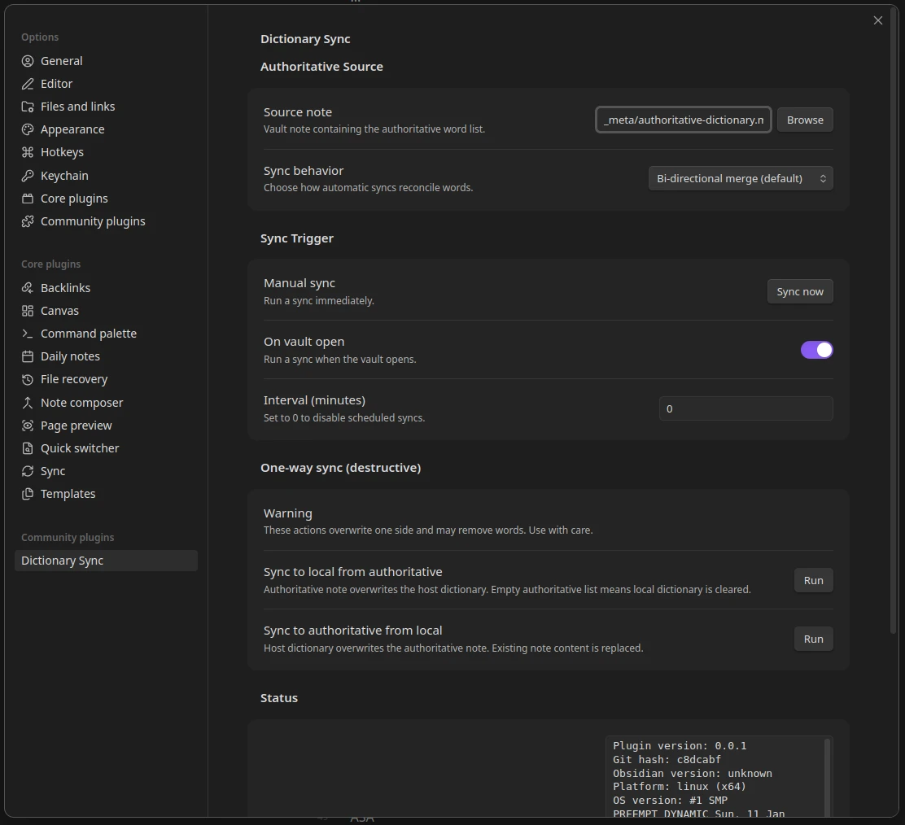
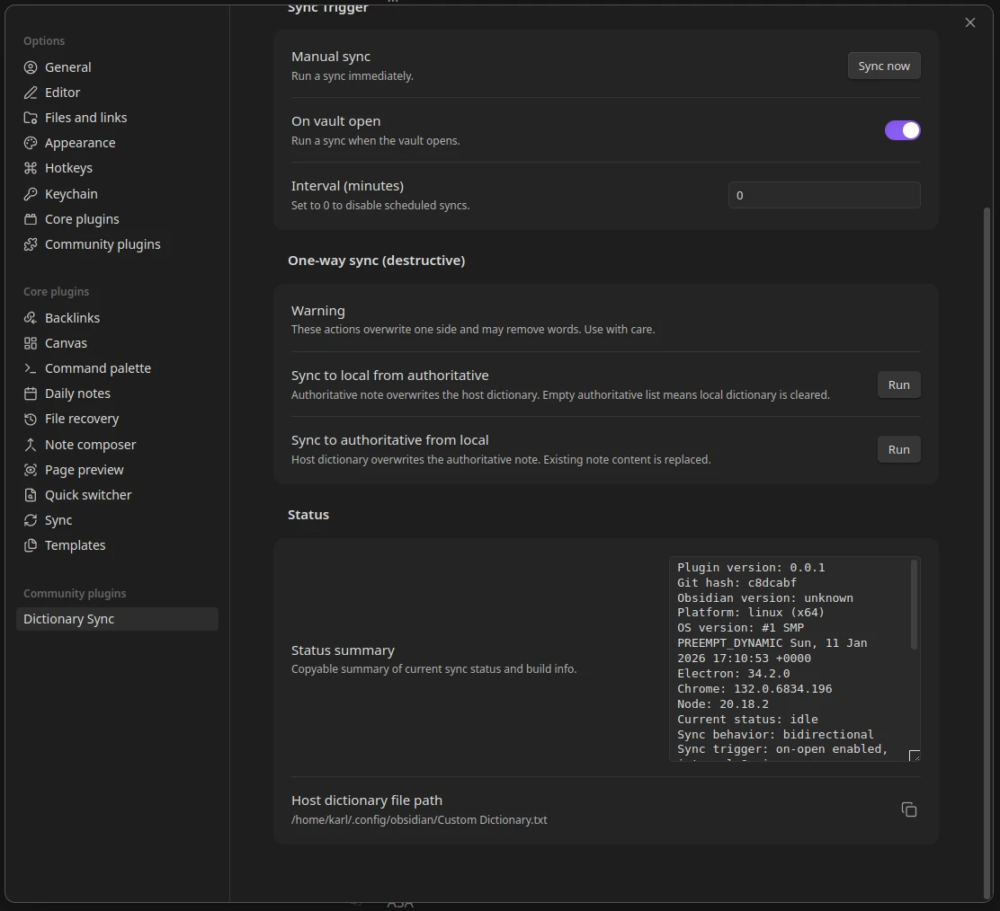
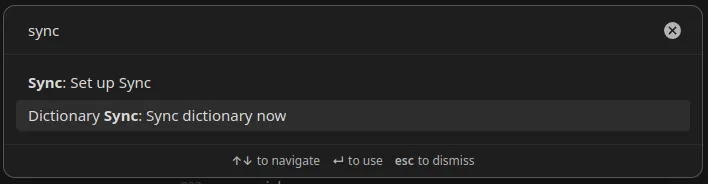

<!-- omit from toc -->
# Obsidian Dictionary Sync Plugin

A simple plugin that can synchronize the user's spell check dictionary with a note in their vault.

Yes, it's [vibe-coded](https://simonw.substack.com/p/not-all-ai-assisted-programming-is).
Make backups of your data before using this plugin, regardless of weather you trust AI-generated code or not.

## Background

For a very brief time early in Obsidian's life, the spell check dictionary was stored as a data file inside the user's vault.
This is [no longer the case](https://forum.obsidian.md/t/where-is-the-user-spell-check-dictionary-file-located/35714/2) and now all user dictionary words are stored in the Electron app's data directory.

This makes it impossible to synchronize the user dictionary across multiple devices using Obsidian Sync or any other sync tool that only syncs the vault contents.

It was never really explained _why_ this change was made but several people have noticed and requested a solution.
A few relevant forum threads:

- [Sync for spellcheck User Dictionary \- Feature requests \- Obsidian Forum](https://forum.obsidian.md/t/sync-for-spellcheck-user-dictionary/29796)
- [Spellcheck dictionary be an editable note](https://forum.obsidian.md/t/spellcheck-dictionary-be-an-editable-note/77046)
- [Dictionary sync tool](https://forum.obsidian.md/t/dictionary-sync-tool/53572)

Over the years, I have created a few different solutions to this problem:

- [GitHub \- kquinsland/obsidian\-dictionary\-sync\-tool: A simple script to automate keeping a \`Custom Dictionary\.txt\` in sync between devices](https://github.com/kquinsland/obsidian-dictionary-sync-tool)
- [GitHub \- kquinsland/obsidian\-dict\-sync: A rust port of simple tool for synchronizing Custom Dictionary files across obsidian\.md hosts](https://github.com/kquinsland/obsidian-dict-sync)

Those tools are more or less identical, just in different languages.
They both suffer from the same problems:

- They work external to Obsidian so the user must remember to run them manually or set up some kind of external automation.
- They make changes to the `Custom Dictionary.txt` directly without the underlying Electron framework being aware of those changes. The only way to make these changes safely is to first quit Obsidian.

The Right Way™ to solve this problem is using the APIs that Obsidian exposes to plugins to read and write to the spell check dictionary natively.
Although it's worth noting that this also has some [limitations](#limitations).
This meant writing JavaScript - something I haven't done in at least a decade - and learning the Obsidian plugin API.
Not _difficult_ but time consuming.
The rust tool was working well for my needs and I was reluctant to invest the time.

Recently, two things changed:

- LLMs have gotten _really_ good at writing code.
- I stumbled into a repo that has boiler-plate code for Obsidian plugins already set up **and** extensive LLM-friendly integrations/skills/notes.

At this point, I've spent more time documenting this plugin  and testing it than I have spent coaching the LLM to write it.

### Limitations

Because Obsidian now uses Electron's built-in spell checker, you are limited to a _single_ custom dictionary for the entire Obsidian app.
This means that if you have multiple vaults, they will all share the same custom dictionary.
For most people, this either isn't a problem or is even desirable but it's worth noting this for any tool that, for example, tries to synchronize a custom dictionary across multiple devices using a note within a vault.

## Credits

The only reason this repo / plugin exist is because `davidvkimball` already did a _ton_ of the heavy lifting with their [`obsidian-sample-plugin-plus` repo](https://github.com/davidvkimball/obsidian-sample-plugin-plus).

That repo has a ton of useful LLM friendly skills/notes... etc that accelerated my ability to get this plugin working.
This repo is a fork/clone of that repo with my plugin code added on top.

I have kept David's name in the LICENSE file since I have not changed any of the licensing terms.

## Installing

Until this plugin is published to the Obsidian Community Plugins list, (see status in [issue #1](https://github.com/kquinsland/obsidian-plugin-dictionary-sync/issues/1)) you can install it manually by fetching the latest build from the [releases page](https://github.com/kquinsland/obsidian-plugin-dictionary-sync/releases) and copying the `main.js`, `styles.css`, `manifest.json` files into your vault's plugins directory:

When done, it should look something like this:

<!-- -->
```shell
<vault root>
├── some-note.md
├── another-note.md
├── _meta
│   └── authoritative-dictionary.md
├── .obsidian
│ # <...>
│   ├── plugins
│   │   └── obsidian-dictionary-sync
│   │       ├── data.json
│   │       ├── main.js
│   │       ├── manifest.json
│   │       └── styles.css
│   └── workspace.json
└── another-note.md
```

Launch obsidian and enable the plugin from the Community Plugins settings page.

## Usage

A picture is worth a thousand words so here is the settings UI that the plugin provides:



And the second half:



### Authoritative source

You must delegate a note in your vault that will serve as the authoritative source for your dictionary words.
This note lives inside of your vault so that it can be synchronized using Obsidian Sync or any other sync tool that you use.
This note may have frontmatter and code blocks and comments but anything else will be treated as a list of words, one per line.
Everything after the first whitespace on each line will be ignored.

**I would recommend keeping this note as simple as possible to minimize the chances of accidentally adding non-word content to your dictionary.**

#### Sync Mode

There are two sync modes:

- Bidirectional: Changes in either the note or the spell check dictionary will be propagated to the other.
- "add only": Only new words from the note will be added to the spell check dictionary. Words removed from the note will not be removed from the dictionary.

The "add only" mode is useful if you want to maintain a growing list of custom words without worrying about accidentally removing words from your dictionary by deleting them from the note.
I added this mode after discovering that [all vaults on one computer will share the same custom dictionary](#limitations) so removing words from the note in one vault would remove them from the dictionary in all vaults.

In most cases, you probably want the bidirectional mode so that you can keep your note and dictionary in sync.

You can manually trigger a sync by clicking the `Sync Now` button in the settings UI or via the Command Palette.



You can also trigger a sync when Obsidian starts up or at regular intervals by enabling those options in the settings UI.

### One-way sync

> [!WARNING]
> The buttons in this section are primarily intended for testing and debugging.
> They can do destructive operations on your dictionary and/or note!

There are also buttons to perform one-way syncs in either direction.
I am leaving these 'exposed' in the UI since they may be useful for some users but they are primarily intended for testing and debugging.
If you do not understand what they do, I would recommend ignoring them.

If you understand what they do, you may find it useful to:

1) set your 'authoritative note' to be empty
2) click the `Sync to local from authoritative` button to clear your dictionary

But other than that, really just test/debug with these buttons.

## Support

Support is going to be limited.
This is a personal project that I created to solve my own problem.
If you find it useful and want to help improve it, please consider submitting pull requests.

## TODO

- Release initial version
  - [ ] Squash/reset history
- [ ] Wire up repo to [Obsidian Community Plugins list](https://publish.obsidian.md/hub/04+-+Guides%2C+Workflows%2C+%26+Courses/Guides/How+to+add+your+plugin+to+the+community+plugin+list)
- [ ] Lots of room for automation / testing. I know _nothing_ about the state of the art w/r/t JS in general, let alone Obsidian plugin testing.
  - is there a way to run obsidian heedlessly for testing purposes? Could be nice to automate screenshots of the settings UI... etc

- Archive my `rust` [repo](https://github.com/kquinsland/obsidian-dict-sync)
  - Push a small update to the readme to point to this new plugin repo
  - Close all PRs on that repo

- Announce plugin on Obsidian forum?
